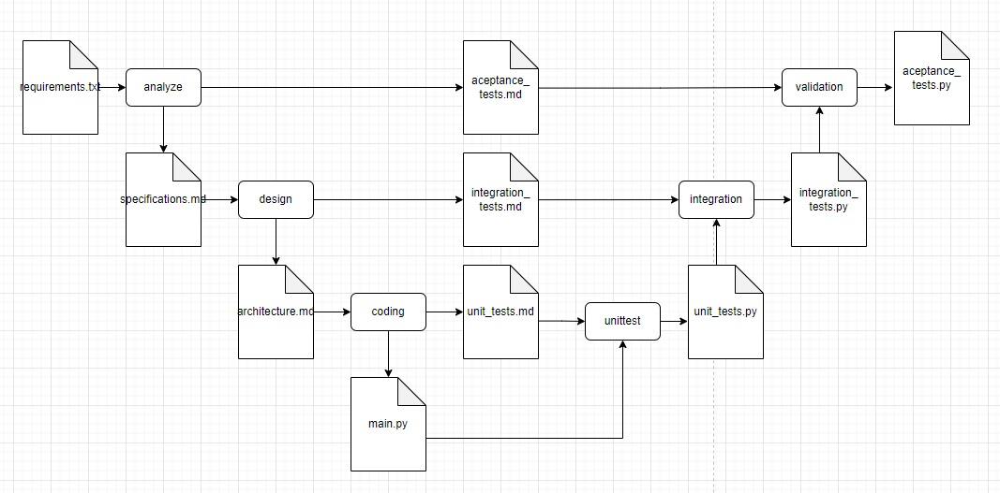

# Gpt_V_Model

Gpt_V_Model is a Python application that harnesses the power of GPT (Generative Pre-trained Transformer) to build customized applications based on user descriptions following the V-Model. 

## How It Works

