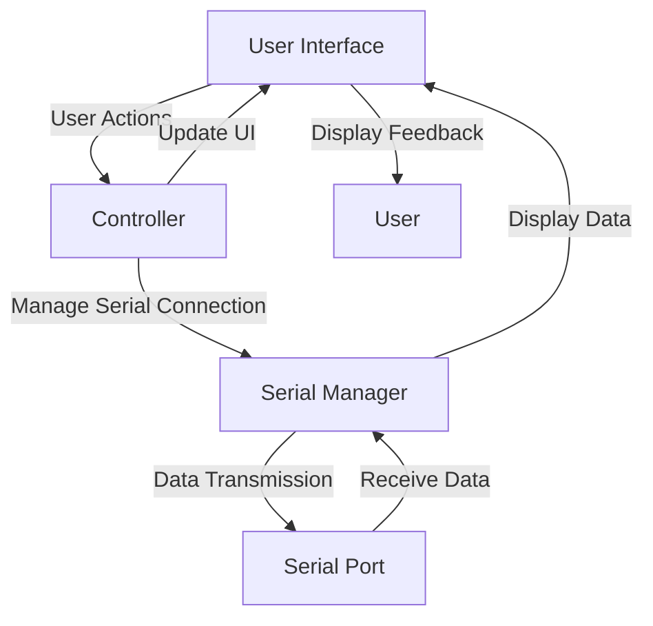
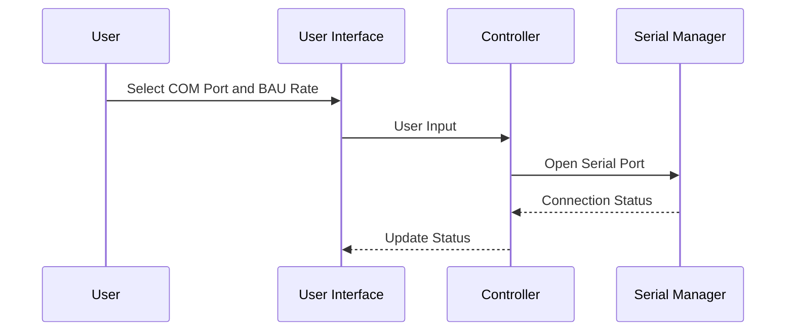
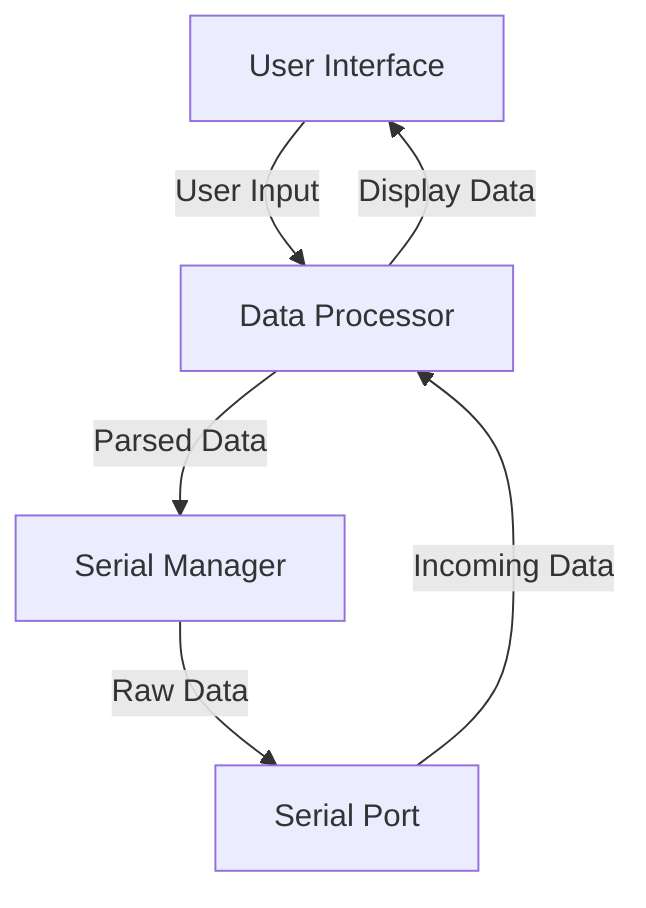

# Architecture

# 1. Introduction
## 1.1 Purpose
The purpose of this document is to provide a comprehensive architectural overview of the Serial Terminal Application. It aims to describe the system's structure, components, and their interactions to give stakeholders a clear understanding of how the application is designed and operates.

## 1.2 Scope
This document covers the system architecture, including high-level architecture diagrams, subsystem descriptions, data architecture, and the interactions between different components of the Serial Terminal Application.

## 1.3 Definitions, Acronyms, and Abbreviations
- **GUI**: Graphical User Interface
- **COM Port**: Communication Port
- **BAU Rate**: Baud rate, the rate at which information is transferred in a communication channel.

## 1.4 References
N/A

## 1.5 Overview
The document is structured to first present the system architecture, followed by detailed descriptions of subsystems and data architecture. Supporting diagrams are included to aid understanding.

# 2. System Architecture
## 2.0 System Architecture Diagram/s

## 2.1 System Overview
The Serial Terminal Application is structured around a Model-View-Controller (MVC) architecture to separate concerns, enhance maintainability, and improve the user experience.

## 2.2 User Interface
### 2.2.1 Components
- **Buttons**: For opening/closing COM ports, refreshing COM port list, sending data, etc.
- **Text Areas**: For displaying incoming and outgoing data.
- **Dropdown Lists**: For selecting COM ports and BAU rates.

### 2.2.2 Interactions
The User Interface interacts directly with the user, capturing user inputs and displaying data or feedback accordingly.

## 2.3 Controller
### 2.3.1 Components
- **Event Handlers**: Manage user actions from the GUI.
- **Serial Connection Manager**: Handles opening, closing, and managing serial port connections.

### 2.3.2 Interactions
#### 2.3.2.1 Interactions Diagram/s

# 3. Data Architecture
## 3.0 Data Architecture Diagram/s

## 3.1 Data Flow
Data flows from the user input through the system to the serial port and back, with processing and parsing at each step to ensure correct transmission and display.

## 3.2 Data Storage
The application does not persist data between sessions, but it allows for logging session data to a file for later review.

## 3.3 Data Access
Data access is primarily through the application's GUI, with the Serial Manager providing an interface to the serial port's data stream.

# 4. Supporting Information
## 4.1 Table of Contents
(Generated automatically by markdown or document generation tools)

## 4.2 Appendix A: Diagrams
Includes all mermaid diagrams presented in this document.

## 4.3 Appendix B: References
N/A

## 4.4 Index
(Generated automatically by markdown or document generation tools)