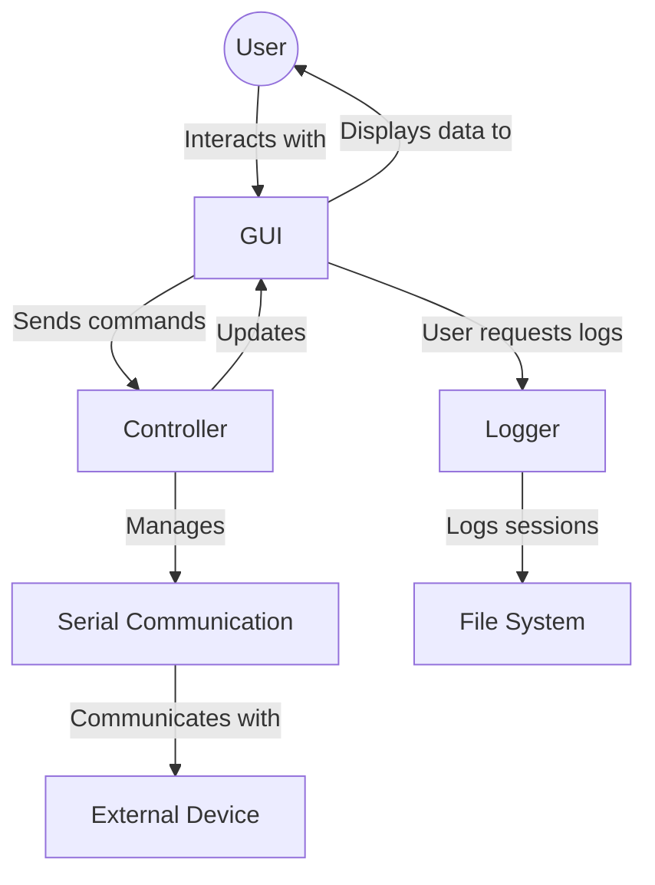
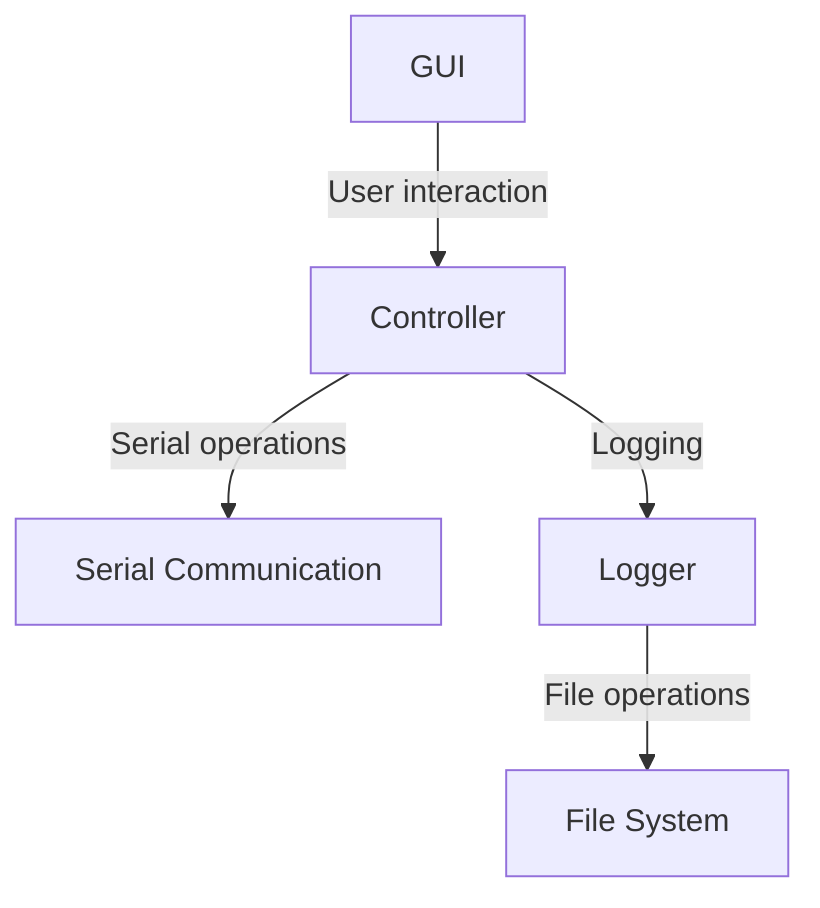

# High Level Design

# 1. Introduction
## 1.1 Purpose
The purpose of this document is to provide a high-level overview of the design of the Serial Terminal Application. It aims to outline the major components and their interactions within the system, providing a clear picture of how the application functions from a design perspective.

## 1.2 Scope
This document covers the high-level design of the Serial Terminal Application, including system overview diagrams, descriptions of major components, and their interactions.

## 1.3 Definitions, Acronyms, and Abbreviations
- **GUI**: Graphical User Interface
- **COM Port**: Communication Port
- **BAU Rate**: Baud rate, the rate at which information is transferred in a communication channel.

## 1.4 References
N/A

## 1.5 Overview
The document is structured to first present an overview of the system, followed by detailed descriptions of the major components and their interactions. Supporting diagrams are included to aid understanding.

# 2. System Overview
## 2.0 System Overview Diagram/s

## 2.1 Major Components
### 2.1.0 Major Components Diagram/s

### 2.1.1 GUI
The GUI is the interface through which the user interacts with the application. It includes buttons, text areas, and dropdown lists for COM port and BAU rate selection, data transmission, and session logging.

### 2.1.2 Controller
The Controller acts as the intermediary between the GUI and the Serial Communication component. It processes user actions, manages serial port operations, and updates the GUI based on the results of these operations.

### 2.1.3 Serial Communication
This component is responsible for handling all operations related to serial communication, including opening and closing COM ports, configuring BAU rates, and sending/receiving data.

### 2.1.4 Logger
The Logger component is tasked with logging session data to files. It interacts with the file system to save and retrieve log files as requested by the user through the GUI.

## 2.2 Interactions
### 2.2.1 User Interaction with GUI
The user interacts with the GUI to perform actions such as selecting COM ports, sending data, and requesting logs. The GUI captures these actions and communicates them to the Controller.

### 2.2.2 Controller and Serial Communication
The Controller sends commands to the Serial Communication component based on user actions, such as opening a COM port or sending data. It also receives data from this component to display in the GUI.

### 2.2.3 Logging and File System Interaction
Upon user request, the Logger component logs session data to the file system. It also retrieves log files for the user to view past session data.

# 3. Supporting Information
## 3.1 Table of Contents
(Generated automatically by markdown or document generation tools)

## 3.2 Appendix A: Diagrams
Includes all mermaid diagrams presented in this document.

## 3.3 Appendix B: References
N/A

## 3.4 Index
(Generated automatically by markdown or document generation tools)