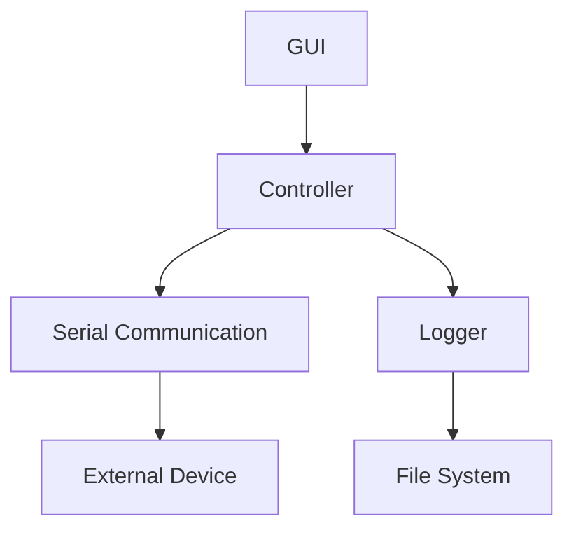

# Low Level Design

# 1. Introduction
## 1.1 Purpose
The purpose of this document is to detail the low-level design of the Serial Terminal Application. It focuses on the specific implementation details of components and modules, providing a comprehensive view of how each part of the application is constructed and how they interact.

## 1.2 Scope
This document covers the detailed design of all components within the Serial Terminal Application, including diagrams and descriptions of modules and their interactions.

## 1.3 Definitions, Acronyms, and Abbreviations
- **GUI**: Graphical User Interface
- **COM Port**: Communication Port
- **BAU Rate**: Baud rate, the rate at which information is transferred in a communication channel.

## 1.4 References
N/A

## 1.5 Overview
The document is structured to first present component diagrams, followed by detailed descriptions of each component and its modules. Supporting information is provided at the end.

# 2. Component Details
## 2.0 Component Diagram/s

## 2.1 GUI
### 2.1.1 Main Window
- **Description**: The main window module handles the overall layout and appearance of the application.
- **Responsibilities**: Displaying buttons, text areas, and dropdown lists. Managing user interactions.

### 2.1.2 Event Handlers
- **Description**: This module processes all GUI events, such as button clicks and dropdown selections.
- **Responsibilities**: Triggering actions in the Controller based on user inputs.

## 2.2 Controller
### 2.2.1 Serial Manager
- **Description**: Manages serial port operations, including opening, closing, and data transmission.
- **Responsibilities**: Communicating with the Serial Communication component to perform serial operations.

### 2.2.2 UI Updater
- **Description**: Responsible for updating the GUI based on the results of operations or incoming data.
- **Responsibilities**: Displaying data in the GUI and showing error messages or status updates.

## 2.3 Serial Communication
### 2.3.1 Serial Port Handler
- **Description**: Handles the low-level operations of serial port communication.
- **Responsibilities**: Opening and closing COM ports, configuring BAU rates, sending and receiving data.

### 2.3.2 Data Processor
- **Description**: Processes incoming and outgoing data for transmission or display.
- **Responsibilities**: Formatting data for sending, parsing incoming data for display.

## 2.4 Logger
### 2.4.1 Session Logger
- **Description**: Manages logging of session data to files.
- **Responsibilities**: Writing sent and received data to log files, retrieving log files for user review.

### 2.4.2 File Manager
- **Description**: Handles file operations for the Logger.
- **Responsibilities**: Opening, closing, and managing log files on the file system.

# 3. Supporting Information
## 3.1 Table of Contents
(Generated automatically by markdown or document generation tools)

## 3.2 Appendix A: Diagrams
Includes all diagrams presented in this document.

## 3.3 Appendix B: References
N/A

## 3.4 Index
(Generated automatically by markdown or document generation tools)