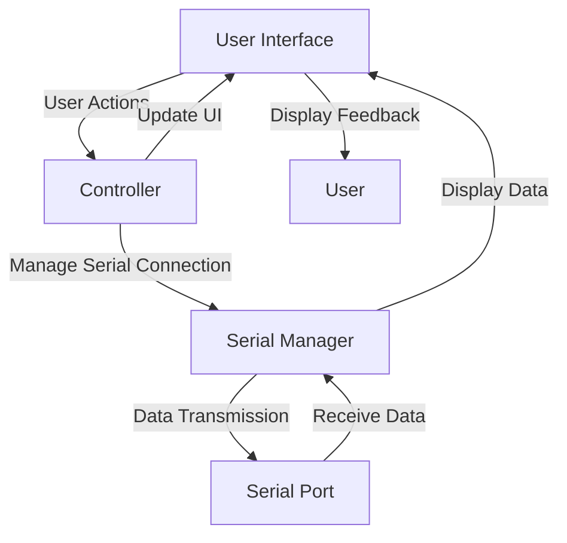
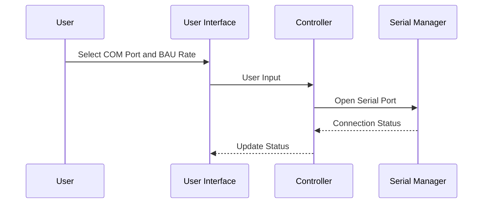
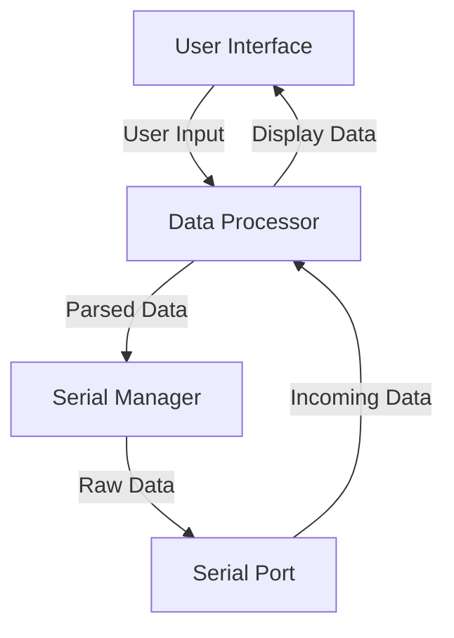
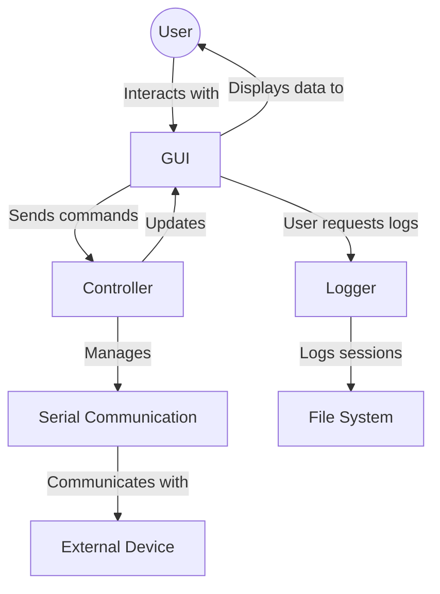
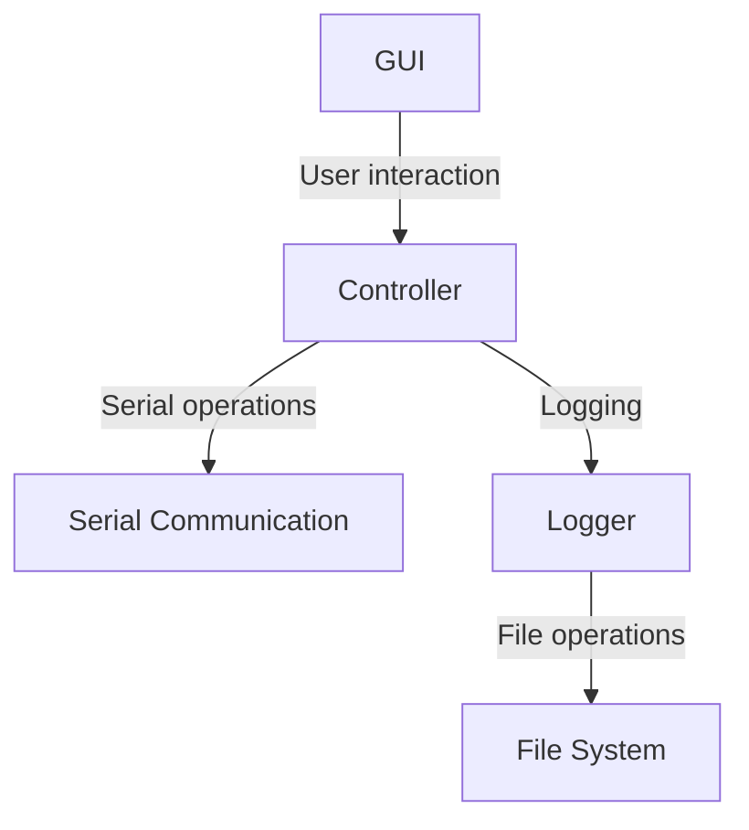
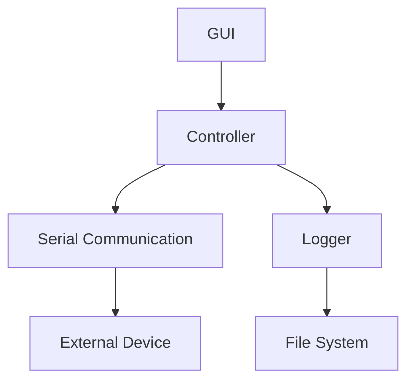

# Requirements

# 1. Introduction
## 1.1 Purpose
The purpose of this document is to provide a detailed description of the requirements for the Serial Terminal Application. It aims to outline the functionality, interfaces, and constraints of the application to ensure clear communication between stakeholders and the development team.

## 1.2 Scope
The Serial Terminal Application is designed to facilitate communication with devices over serial ports. It will allow users to open and close COM ports, configure settings, send and receive data, and log terminal sessions.

## 1.3 Definitions, Acronyms, and Abbreviations
- **COM Port**: Communication Port, a serial port interface on computers for connecting peripherals.
- **BAU Rate**: Baud rate, the rate at which information is transferred in a communication channel.
- **GUI**: Graphical User Interface.

## 1.4 References
N/A

## 1.5 Overview
The remainder of this document provides a general description of the product, specific requirements including functional and non-functional requirements, and supporting information.

# 2. General Description
## 2.1 Product Perspective
The Serial Terminal Application is a standalone software tool intended for users who need to communicate with devices via serial ports. It is designed to be intuitive and user-friendly, catering to both novice and experienced users.

## 2.2 Product Functions
- Open and close COM ports.
- Select BAU rates.
- Send and receive data.
- Display incoming data and sent data with color differentiation.
- Log terminal sessions.

## 2.3 User Characteristics
The application is intended for technicians, engineers, hobbyists, and anyone who needs to interact with devices over serial communication.

## 2.4 General Constraints
- The application is limited to systems with available serial ports.
- The performance is dependent on the system's hardware and operating system.

## 2.5 Assumptions and Dependencies
- It is assumed that the user has basic knowledge of serial communication.
- The application's functionality is dependent on the correct selection of COM ports and BAU rates.

# 3. Specific Requirements
## 3.0 Requirements Tables 
| REQ_ID | Type         | Description |
|--------|--------------|-------------|
| REQ_01 | GUI Layout   | Application must have buttons at the top for selecting COM port and BAU rate. |
| REQ_02 | GUI Layout   | Application must include buttons to open and close the selected COM port. |
| REQ_03 | GUI Layout   | Application must have a long text area in the center for displaying incoming data and data sent in green color. |
| REQ_04 | GUI Layout   | Application must include a text input below the text area for typing out messages to send. |
| REQ_05 | GUI Layout   | Application must have a send button next to the text input for sending messages. |
| REQ_06 | Functionality| Application must have a background thread for continuously reading from the serial port when it's open. |
| REQ_07 | Functionality| Incoming data must be displayed in the terminal within the text area. |
| REQ_08 | Functionality| Data sent through the application must be displayed in the terminal with green color. |
| REQ_09 | Functionality| The application must allow selection of different BAU rates from a predefined list or through manual entry. |
| REQ_10 | Functionality| The application must validate the selected COM port and BAU rate before attempting to open the port. |

## 3.1 External Interface Requirements
### 3.1.1 User Interfaces
The application will have a GUI with components as specified in the requirements table, including buttons, text areas, and dropdown lists for interaction.

### 3.1.2 Hardware Interfaces
The application interfaces with serial ports available on the host computer.

### 3.1.3 Software Interfaces
The application will be developed in Python, utilizing libraries such as PyQt for the GUI and PySerial for serial communication.

### 3.1.4 Communications Interfaces
The application communicates over serial ports using specified BAU rates and COM port settings.

## 3.2 Functional Requirements
Refer to the Requirements Table in section 3.0 for detailed functional requirements.

## 3.3 Performance Requirements
- The application must handle real-time serial communication without causing UI freezes.
- The background reading process must efficiently process incoming data without loss.

## 3.4 Design Constraints
- The application is designed for systems with Python and necessary libraries installed.
- GUI layout and functionality are constrained by the capabilities of the PyQt framework.

## 3.5 Software System Attributes
### 3.5.1 Reliability
The application must perform consistently under varying conditions without failure.

### 3.5.2 Availability
The application should be available for use whenever the user's system is operational and a serial device is connected.

### 3.5.3 Security
N/A

### 3.5.4 Maintainability
The codebase should be well-documented and structured for easy maintenance and future enhancements.

### 3.5.5 Portability
The application should be portable across Windows, Linux, and macOS platforms where Python and dependencies are supported.

## 3.6 Other Requirements
N/A

# 4. Supporting Information
## 4.1 Table of Contents
(Generated automatically by markdown or document generation tools)

## 4.2 Appendix A: Glossary
See section 1.3 for definitions, acronyms, and abbreviations.

## 4.3 Appendix B: Analysis Models
N/A

## 4.4 Appendix C: To Be Determined List
- Finalize list of supported BAU rates.
- Determine additional languages for internationalization.

## 4.5 Appendix D: Issues List
- UI responsiveness during high data throughput.

## 4.6 Appendix E: Guidelines
- Follow coding standards for Python and PyQt development.
- Ensure thorough testing of serial communication functionalities.

## 4.7 Appendix F: References
N/A

## 4.8 Index
(Generated automatically by markdown or document generation tools)# Acceptance Testing

# 1. Introduction
## 1.1 Purpose
The purpose of this document is to outline the acceptance testing procedures for the Serial Terminal Application. It aims to ensure that the application meets all specified requirements and provides a satisfactory user experience.

## 1.2 Scope
This document covers the acceptance testing criteria for the Serial Terminal Application, including user acceptance tests and performance acceptance tests.

## 1.3 Definitions, Acronyms, and Abbreviations
- **GUI**: Graphical User Interface
- **COM Port**: Communication Port
- **BAU Rate**: Baud rate, the rate at which information is transferred in a communication channel.

## 1.4 References
N/A

## 1.5 Overview
The document is structured to first present the acceptance criteria, followed by detailed descriptions of user and performance acceptance tests. Supporting information is provided at the end.

# 2. Acceptance Criteria
## 2.0 Acceptance Tests Tables
| TEST_ID | Type | Description | Traceability |
|---------|------|-------------|--------------|
| ACEPTANCE_TEST_01 | GUI Layout | Verify buttons for selecting COM port and BAU rate are present and functional. | REQ_01 |
| ACEPTANCE_TEST_02 | GUI Layout | Verify buttons to open and close the selected COM port work as expected. | REQ_02 |
| ACEPTANCE_TEST_03 | GUI Layout | Check the text area for displaying incoming and sent data in green color. | REQ_03, REQ_08 |
| ACEPTANCE_TEST_04 | GUI Layout | Ensure the text input for typing messages and the send button function correctly. | REQ_04, REQ_05 |
| ACEPTANCE_TEST_05 | Functionality | Test continuous reading from the serial port in a background thread. | REQ_06 |
| ACEPTANCE_TEST_06 | Functionality | Incoming data is correctly displayed in the terminal area. | REQ_07 |
| ACEPTANCE_TEST_07 | Functionality | Validate selection and manual entry of BAU rates. | REQ_09 |
| ACEPTANCE_TEST_08 | Functionality | Confirm validation of COM port and BAU rate before opening the port. | REQ_10 |
| ACEPTANCE_TEST_09 | Usability | Test feedback/error messages for unsuccessful operations. | REQ_11 |
| ACEPTANCE_TEST_10 | Performance | Ensure the UI does not freeze or slow down due to the background reading process. | REQ_12 |

## 2.1 User Acceptance Tests
### 2.1.1 Test Case 1: GUI Layout Verification
- **Procedure**: Navigate through the application's GUI, verifying the presence and functionality of all buttons and text areas as specified in the requirements.
- **Expected Result**: All GUI elements are present, correctly labeled, and functional.

### 2.1.2 Test Case 2: Serial Communication
- **Procedure**: Open a COM port, send data through the text input, and verify that it is sent and displayed in green in the text area. Receive data and ensure it is displayed in the text area.
- **Expected Result**: Data sent and received is correctly displayed in the terminal area, with sent data highlighted in green.

### 2.1.3 Test Case 3: BAU Rate and COM Port Validation
- **Procedure**: Attempt to select and manually enter BAU rates, and select COM ports. Try opening a COM port with invalid settings.
- **Expected Result**: The application allows selection and manual entry of BAU rates, validates COM port and BAU rate before opening, and provides feedback for invalid settings.

## 2.2 Performance Acceptance Tests
### 2.2.1 Test Case 1: Background Reading Process
- **Procedure**: With a COM port open, simulate continuous data transmission to the application. Observe application responsiveness and data display.
- **Expected Result**: The application remains responsive, and incoming data is displayed without delay or loss.

### 2.2.2 Test Case 2: UI Responsiveness
- **Procedure**: While sending and receiving data, interact with various GUI elements.
- **Expected Result**: The UI remains responsive, with no freezes or significant slowdowns.

# 3. Supporting Information
## 3.1 Table of Contents
(Generated automatically by markdown or document generation tools)

## 3.2 Appendix A: Test Cases
Detailed descriptions of each test case are provided in sections 2.1 and 2.2.

## 3.3 Appendix B: References
N/A

## 3.4 Index
(Generated automatically by markdown or document generation tools)# Architecture

# 1. Introduction
## 1.1 Purpose
The purpose of this document is to provide a comprehensive architectural overview of the Serial Terminal Application. It aims to describe the system's structure, components, and their interactions to give stakeholders a clear understanding of how the application is designed and operates.

## 1.2 Scope
This document covers the system architecture, including high-level architecture diagrams, subsystem descriptions, data architecture, and the interactions between different components of the Serial Terminal Application.

## 1.3 Definitions, Acronyms, and Abbreviations
- **GUI**: Graphical User Interface
- **COM Port**: Communication Port
- **BAU Rate**: Baud rate, the rate at which information is transferred in a communication channel.

## 1.4 References
N/A

## 1.5 Overview
The document is structured to first present the system architecture, followed by detailed descriptions of subsystems and data architecture. Supporting diagrams are included to aid understanding.

# 2. System Architecture
## 2.0 System Architecture Diagram/s

## 2.1 System Overview
The Serial Terminal Application is structured around a Model-View-Controller (MVC) architecture to separate concerns, enhance maintainability, and improve the user experience.

## 2.2 User Interface
### 2.2.1 Components
- **Buttons**: For opening/closing COM ports, refreshing COM port list, sending data, etc.
- **Text Areas**: For displaying incoming and outgoing data.
- **Dropdown Lists**: For selecting COM ports and BAU rates.

### 2.2.2 Interactions
The User Interface interacts directly with the user, capturing user inputs and displaying data or feedback accordingly.

## 2.3 Controller
### 2.3.1 Components
- **Event Handlers**: Manage user actions from the GUI.
- **Serial Connection Manager**: Handles opening, closing, and managing serial port connections.

### 2.3.2 Interactions
#### 2.3.2.1 Interactions Diagram/s


# 3. Data Architecture
## 3.0 Data Architecture Diagram/s

## 3.1 Data Flow
Data flows from the user input through the system to the serial port and back, with processing and parsing at each step to ensure correct transmission and display.

## 3.2 Data Storage
The application does not persist data between sessions, but it allows for logging session data to a file for later review.

## 3.3 Data Access
Data access is primarily through the application's GUI, with the Serial Manager providing an interface to the serial port's data stream.

# 4. Supporting Information
## 4.1 Table of Contents
(Generated automatically by markdown or document generation tools)

## 4.2 Appendix A: Diagrams
Includes all mermaid diagrams presented in this document.

## 4.3 Appendix B: References
N/A

## 4.4 Index
(Generated automatically by markdown or document generation tools)# System Testing

# 1. Introduction
## 1.1 Purpose
The purpose of this document is to outline the system testing strategy for the Serial Terminal Application. It aims to ensure that the application meets its requirements and functions correctly as a whole.

## 1.2 Scope
This document covers the system testing phase of the Serial Terminal Application, detailing the test cases designed to validate the integrated functionality of the application.

## 1.3 Definitions, Acronyms, and Abbreviations
- **GUI**: Graphical User Interface
- **COM Port**: Communication Port
- **BAU Rate**: Baud rate, the rate at which information is transferred in a communication channel.

## 1.4 References
N/A

## 1.5 Overview
The document is structured to first present the test cases, followed by expected test results. Supporting information is provided at the end.

# 2. Test Cases
## 2.0 Test Cases Table
| TEST_ID | Type | Description | Traceability |
|---------|------|-------------|--------------|
| SYSTEM_TEST_01 | GUI Functionality | Verify all GUI elements are present and functional. | REQ_01, REQ_02, REQ_03, REQ_04, REQ_05 |
| SYSTEM_TEST_02 | Serial Communication | Test opening, sending data through, and closing a COM port. | REQ_06, REQ_07, REQ_08 |
| SYSTEM_TEST_03 | BAU Rate Selection | Validate the selection and manual entry of BAU rates. | REQ_09 |
| SYSTEM_TEST_04 | COM Port Validation | Test validation of COM port and BAU rate before opening. | REQ_10 |
| SYSTEM_TEST_05 | Error Feedback | Verify feedback/error messages for unsuccessful operations. | REQ_11 |
| SYSTEM_TEST_06 | UI Responsiveness | Ensure the UI does not freeze or slow down during operation. | REQ_12 |
| SYSTEM_TEST_07 | Clear Functionality | Test the clear button functionality to clear the text area. | REQ_13 |
| SYSTEM_TEST_08 | Save Log Functionality | Verify the save log functionality works as expected. | REQ_14 |
| SYSTEM_TEST_09 | Copy Text Functionality | Test the ability to copy selected text from the terminal area. | REQ_15 |
| SYSTEM_TEST_10 | Automatic Scrolling | Ensure automatic scrolling to the bottom of the terminal area works. | REQ_16 |

## 2.1 Test Case 1: GUI Functionality
- **Procedure**: Navigate through the application's GUI, verifying the presence and functionality of all buttons, text areas, and dropdown lists.
- **Expected Result**: All GUI elements function as intended, allowing for interaction.

## 2.2 Test Case 2: Serial Communication
- **Procedure**: Open a COM port, send data, and then close the port. Observe the data transmission and reception.
- **Expected Result**: Data is correctly sent and received, with sent data displayed in green.

## 2.3 Test Case 3: BAU Rate Selection
- **Procedure**: Select different BAU rates from the dropdown and enter a BAU rate manually.
- **Expected Result**: The application accepts both predefined and manually entered BAU rates.

# 3. Test Results (Expected)
## 3.1 Test Case 1 Results
All GUI elements are verified to be present and functional, meeting the requirements specified.

## 3.2 Test Case 2 Results
Serial communication is successful, with data correctly sent and received, and sent data displayed in green, confirming the application's functionality.

## 3.3 Test Case 3 Results
The application correctly handles the selection and manual entry of BAU rates, validating the functionality against the requirements.

# 4. Supporting Information
## 4.1 Table of Contents
(Generated automatically by markdown or document generation tools)

## 4.2 Appendix A: Test Cases
Detailed descriptions of each test case are provided in section 2.

## 4.3 Appendix B: References
N/A

## 4.4 Index
(Generated automatically by markdown or document generation tools)# High Level Design

# 1. Introduction
## 1.1 Purpose
The purpose of this document is to provide a high-level overview of the design of the Serial Terminal Application. It aims to outline the major components and their interactions within the system, providing a clear picture of how the application functions from a design perspective.

## 1.2 Scope
This document covers the high-level design of the Serial Terminal Application, including system overview diagrams, descriptions of major components, and their interactions.

## 1.3 Definitions, Acronyms, and Abbreviations
- **GUI**: Graphical User Interface
- **COM Port**: Communication Port
- **BAU Rate**: Baud rate, the rate at which information is transferred in a communication channel.

## 1.4 References
N/A

## 1.5 Overview
The document is structured to first present an overview of the system, followed by detailed descriptions of the major components and their interactions. Supporting diagrams are included to aid understanding.

# 2. System Overview
## 2.0 System Overview Diagram/s

## 2.1 Major Components
### 2.1.0 Major Components Diagram/s

### 2.1.1 GUI
The GUI is the interface through which the user interacts with the application. It includes buttons, text areas, and dropdown lists for COM port and BAU rate selection, data transmission, and session logging.

### 2.1.2 Controller
The Controller acts as the intermediary between the GUI and the Serial Communication component. It processes user actions, manages serial port operations, and updates the GUI based on the results of these operations.

### 2.1.3 Serial Communication
This component is responsible for handling all operations related to serial communication, including opening and closing COM ports, configuring BAU rates, and sending/receiving data.

### 2.1.4 Logger
The Logger component is tasked with logging session data to files. It interacts with the file system to save and retrieve log files as requested by the user through the GUI.

## 2.2 Interactions
### 2.2.1 User Interaction with GUI
The user interacts with the GUI to perform actions such as selecting COM ports, sending data, and requesting logs. The GUI captures these actions and communicates them to the Controller.

### 2.2.2 Controller and Serial Communication
The Controller sends commands to the Serial Communication component based on user actions, such as opening a COM port or sending data. It also receives data from this component to display in the GUI.

### 2.2.3 Logging and File System Interaction
Upon user request, the Logger component logs session data to the file system. It also retrieves log files for the user to view past session data.

# 3. Supporting Information
## 3.1 Table of Contents
(Generated automatically by markdown or document generation tools)

## 3.2 Appendix A: Diagrams
Includes all mermaid diagrams presented in this document.

## 3.3 Appendix B: References
N/A

## 3.4 Index
(Generated automatically by markdown or document generation tools)# Integration Testing

# 1. Introduction
## 1.1 Purpose
The purpose of this document is to outline the integration testing strategy for the Serial Terminal Application. It aims to ensure that the application's components interact correctly and function as a cohesive unit.

## 1.2 Scope
This document covers the integration testing phase of the Serial Terminal Application, detailing the test cases designed to validate the interactions between different components of the application.

## 1.3 Definitions, Acronyms, and Abbreviations
- **GUI**: Graphical User Interface
- **COM Port**: Communication Port
- **BAU Rate**: Baud rate, the rate at which information is transferred in a communication channel.

## 1.4 References
N/A

## 1.5 Overview
The document is structured to first present the test cases, followed by expected test results. Supporting information is provided at the end.

# 2. Test Cases
| TEST_ID | Type | Description | Traceability |
|---------|------|-------------|--------------|
| INTEGRATION_TEST_01 | GUI and Controller | Verify that GUI actions correctly trigger corresponding actions in the Controller. | REQ_01, REQ_02, REQ_04, REQ_05 |
| INTEGRATION_TEST_02 | Controller and Serial Communication | Test that the Controller correctly manages serial communication operations based on GUI inputs. | REQ_06, REQ_07, REQ_08, REQ_09, REQ_10 |
| INTEGRATION_TEST_03 | GUI and Serial Communication | Ensure that data sent and received via serial communication is correctly displayed in the GUI. | REQ_03, REQ_07, REQ_08 |
| INTEGRATION_TEST_04 | Error Handling | Verify that error messages from serial communication failures are correctly displayed in the GUI. | REQ_11 |
| INTEGRATION_TEST_05 | BAU Rate Selection | Test the integration between BAU rate selection in the GUI and its application in serial communication settings. | REQ_09 |
| INTEGRATION_TEST_06 | COM Port Selection and Validation | Ensure that COM port selection and validation in the GUI correctly affects serial communication. | REQ_10 |
| INTEGRATION_TEST_07 | Send and Display Data | Verify that data sent through the GUI is correctly transmitted over the serial port and displayed in the GUI. | REQ_05, REQ_08 |
| INTEGRATION_TEST_08 | Automatic Scrolling | Test the automatic scrolling feature when new data is received or sent in the GUI. | REQ_16 |
| INTEGRATION_TEST_09 | Clear Text Area | Ensure the clear button functionality correctly clears the text area in the GUI. | REQ_13 |
| INTEGRATION_TEST_10 | Save Log Functionality | Test the integration between the GUI's save log button and the logging functionality. | REQ_14 |

## 2.1 Test Case 1: GUI and Controller Integration
- **Procedure**: Perform various actions in the GUI and verify that they trigger the correct responses in the Controller.
- **Expected Result**: Each GUI action results in the appropriate response from the Controller, confirming correct integration.

## 2.2 Test Case 2: Controller and Serial Communication Integration
- **Procedure**: Through GUI actions, initiate serial communication operations and verify that the Controller manages these operations as expected.
- **Expected Result**: Serial communication operations are correctly managed by the Controller, demonstrating successful integration.

## 2.3 Test Case 3: GUI and Serial Communication Integration
- **Procedure**: Send and receive data via the GUI and verify that it is correctly displayed.
- **Expected Result**: Data sent and received is accurately displayed in the GUI, indicating proper integration between the GUI and serial communication.

# 3. Test Results (Expected)
## 3.1 Test Case 1 Results
GUI actions correctly trigger corresponding actions in the Controller, indicating successful integration.

## 3.2 Test Case 2 Results
The Controller effectively manages serial communication operations based on GUI inputs, confirming the integration's success.

## 3.3 Test Case 3 Results
Data sent and received via serial communication is correctly displayed in the GUI, showcasing proper integration.

# 4. Supporting Information
## 4.1 Table of Contents
(Generated automatically by markdown or document generation tools)

## 4.2 Appendix A: Test Cases
Detailed descriptions of each test case are provided in section 2.

## 4.3 Appendix B: References
N/A

## 4.4 Index
(Generated automatically by markdown or document generation tools)# Low Level Design

# 1. Introduction
## 1.1 Purpose
The purpose of this document is to detail the low-level design of the Serial Terminal Application. It focuses on the specific implementation details of components and modules, providing a comprehensive view of how each part of the application is constructed and how they interact.

## 1.2 Scope
This document covers the detailed design of all components within the Serial Terminal Application, including diagrams and descriptions of modules and their interactions.

## 1.3 Definitions, Acronyms, and Abbreviations
- **GUI**: Graphical User Interface
- **COM Port**: Communication Port
- **BAU Rate**: Baud rate, the rate at which information is transferred in a communication channel.

## 1.4 References
N/A

## 1.5 Overview
The document is structured to first present component diagrams, followed by detailed descriptions of each component and its modules. Supporting information is provided at the end.

# 2. Component Details
## 2.0 Component Diagram/s

## 2.1 GUI
### 2.1.1 Main Window
- **Description**: The main window module handles the overall layout and appearance of the application.
- **Responsibilities**: Displaying buttons, text areas, and dropdown lists. Managing user interactions.

### 2.1.2 Event Handlers
- **Description**: This module processes all GUI events, such as button clicks and dropdown selections.
- **Responsibilities**: Triggering actions in the Controller based on user inputs.

## 2.2 Controller
### 2.2.1 Serial Manager
- **Description**: Manages serial port operations, including opening, closing, and data transmission.
- **Responsibilities**: Communicating with the Serial Communication component to perform serial operations.

### 2.2.2 UI Updater
- **Description**: Responsible for updating the GUI based on the results of operations or incoming data.
- **Responsibilities**: Displaying data in the GUI and showing error messages or status updates.

## 2.3 Serial Communication
### 2.3.1 Serial Port Handler
- **Description**: Handles the low-level operations of serial port communication.
- **Responsibilities**: Opening and closing COM ports, configuring BAU rates, sending and receiving data.

### 2.3.2 Data Processor
- **Description**: Processes incoming and outgoing data for transmission or display.
- **Responsibilities**: Formatting data for sending, parsing incoming data for display.

## 2.4 Logger
### 2.4.1 Session Logger
- **Description**: Manages logging of session data to files.
- **Responsibilities**: Writing sent and received data to log files, retrieving log files for user review.

### 2.4.2 File Manager
- **Description**: Handles file operations for the Logger.
- **Responsibilities**: Opening, closing, and managing log files on the file system.

# 3. Supporting Information
## 3.1 Table of Contents
(Generated automatically by markdown or document generation tools)

## 3.2 Appendix A: Diagrams
Includes all diagrams presented in this document.

## 3.3 Appendix B: References
N/A

## 3.4 Index
(Generated automatically by markdown or document generation tools)# Unit Testing

# 1. Introduction
## 1.1 Purpose
The purpose of this document is to outline the unit testing strategy for the Serial Terminal Application. It aims to ensure that each individual unit of the application functions correctly in isolation.

## 1.2 Scope
This document covers the unit testing phase of the Serial Terminal Application, detailing the test cases designed to validate the functionality of individual components and modules within the application.

## 1.3 Definitions, Acronyms, and Abbreviations
- **GUI**: Graphical User Interface
- **COM Port**: Communication Port
- **BAU Rate**: Baud rate, the rate at which information is transferred in a communication channel.

## 1.4 References
N/A

## 1.5 Overview
The document is structured to first present the test cases, followed by expected test results. Supporting information is provided at the end.

# 2. Test Cases
## 2.0 Test Cases Table
| TEST_ID | Type | Description | Traceability |
|---------|------|-------------|--------------|
| UNIT_TEST_01 | GUI Component | Test the presence and functionality of COM port selection dropdown. | REQ_01 |
| UNIT_TEST_02 | GUI Component | Verify functionality of BAU rate selection dropdown. | REQ_09 |
| UNIT_TEST_03 | GUI Component | Ensure open and close COM port buttons trigger correct actions. | REQ_02 |
| UNIT_TEST_04 | Serial Communication | Test opening a COM port with valid settings. | REQ_10 |
| UNIT_TEST_05 | Serial Communication | Verify closing of an open COM port. | REQ_02 |
| UNIT_TEST_06 | Data Transmission | Test sending data through an open COM port. | REQ_05, REQ_08 |
| UNIT_TEST_07 | Data Reception | Verify reception and display of incoming data. | REQ_07 |
| UNIT_TEST_08 | Error Handling | Test error feedback for invalid COM port selection. | REQ_11 |
| UNIT_TEST_09 | Error Handling | Verify error feedback for invalid BAU rate entry. | REQ_11 |
| UNIT_TEST_10 | GUI Component | Test clear button functionality for the text area. | REQ_13 |

## 2.1 Test Case 1: COM Port Selection Dropdown
- **Procedure**: Verify that the COM port selection dropdown is present and populates with available COM ports.
- **Expected Result**: Dropdown is present and correctly lists all available COM ports.

## 2.2 Test Case 2: BAU Rate Selection Dropdown
- **Procedure**: Test the functionality of the BAU rate selection dropdown, including the ability to select predefined rates and enter a custom rate.
- **Expected Result**: Dropdown allows selection of predefined rates and accepts custom rate entry.

## 2.3 Test Case 3: Open and Close COM Port Buttons
- **Procedure**: Verify that clicking the open button opens the selected COM port and that the close button closes it.
- **Expected Result**: The selected COM port is opened and closed as expected.

# 3. Test Results (Expected)
## 3.1 Test Case 1 Results
The COM port selection dropdown is functional, meeting the specified requirements.

## 3.2 Test Case 2 Results
The BAU rate selection dropdown operates correctly, allowing both selection and manual entry of BAU rates.

## 3.3 Test Case 3 Results
The open and close COM port buttons function as intended, successfully opening and closing COM ports.

# 4. Supporting Information
## 4.1 Table of Contents
(Generated automatically by markdown or document generation tools)

## 4.2 Appendix A: Test Cases
Detailed descriptions of each test case are provided in section 2.

## 4.3 Appendix B: References
N/A

## 4.4 Index
(Generated automatically by markdown or document generation tools)```python
# main.py TEMPLATE
# This is a simplified example of a Serial Terminal Application. It demonstrates the basic structure and functionality
# required to meet the specified requirements. This example focuses on GUI layout and basic serial communication functionality.

# Imports
import sys
import logging
from PyQt5.QtWidgets import QApplication, QMainWindow, QWidget, QVBoxLayout, QPushButton, QTextEdit, QLineEdit, QComboBox, QLabel
from PyQt5.QtCore import QThread, pyqtSignal
import serial
import serial.tools.list_ports

# Constants
BAUD_RATES = [9600, 19200, 38400, 57600, 115200]

# Logging setup for debugging
logging.basicConfig(level=logging.DEBUG, format='%(asctime)s - %(levelname)s - %(message)s')

# Functions
def list_com_ports():
    """List available COM ports."""
    ports = serial.tools.list_ports.comports()
    return [port.device for port in ports]

# Classes
class SerialThread(QThread):
    """Background thread for reading serial data."""
    received = pyqtSignal(str)

    def __init__(self, port, baud_rate):
        super().__init__()
        self.serial_port = serial.Serial()
        self.serial_port.port = port
        self.serial_port.baudrate = baud_rate
        self.running = False

    def run(self):
        """Run the thread, reading data from the serial port."""
        self.serial_port.open()
        self.running = True
        while self.running:
            if self.serial_port.in_waiting:
                data = self.serial_port.readline().decode('utf-8').strip()
                self.received.emit(data)
        self.serial_port.close()

    def stop(self):
        """Stop the thread."""
        self.running = False

class SerialTerminal(QMainWindow):
    """Main window class for the Serial Terminal Application."""
    def __init__(self):
        super().__init__()
        self.initUI()
        self.serial_thread = None

    def initUI(self):
        """Initialize the UI."""
        self.setWindowTitle('Serial Terminal')
        self.setGeometry(100, 100, 600, 400)

        # Main layout
        layout = QVBoxLayout()

        # COM port selection
        self.combo_com_ports = QComboBox()
        self.combo_com_ports.addItems(list_com_ports())
        layout.addWidget(self.combo_com_ports)

        # BAUD rate selection
        self.combo_baud_rate = QComboBox()
        self.combo_baud_rate.addItems(map(str, BAUD_RATES))
        layout.addWidget(self.combo_baud_rate)

        # Open and close buttons
        self.btn_open = QPushButton('Open')
        self.btn_open.clicked.connect(self.open_serial_port)
        layout.addWidget(self.btn_open)

        self.btn_close = QPushButton('Close')
        self.btn_close.clicked.connect(self.close_serial_port)
        layout.addWidget(self.btn_close)

        # Terminal display
        self.text_display = QTextEdit()
        layout.addWidget(self.text_display)

        # Input field
        self.line_input = QLineEdit()
        layout.addWidget(self.line_input)

        # Send button
        self.btn_send = QPushButton('Send')
        self.btn_send.clicked.connect(self.send_data)
        layout.addWidget(self.btn_send)

        # Set main widget
        central_widget = QWidget()
        central_widget.setLayout(layout)
        self.setCentralWidget(central_widget)

    def open_serial_port(self):
        """Open the selected serial port."""
        port = self.combo_com_ports.currentText()
        baud_rate = int(self.combo_baud_rate.currentText())
        self.serial_thread = SerialThread(port, baud_rate)
        self.serial_thread.received.connect(self.display_data)
        self.serial_thread.start()
        logging.info(f"Opened serial port {port} at {baud_rate} BAUD.")

    def close_serial_port(self):
        """Close the open serial port."""
        if self.serial_thread:
            self.serial_thread.stop()
            self.serial_thread = None
            logging.info("Closed serial port.")

    def send_data(self):
        """Send data through the serial port."""
        if self.serial_thread and self.serial_thread.serial_port.is_open:
            data = self.line_input.text() + '\n'
            self.serial_thread.serial_port.write(data.encode('utf-8'))
            self.display_data(data, sent=True)
            self.line_input.clear()
            logging.info("Sent data.")

    def display_data(self, data, sent=False):
        """Display received data in the terminal area."""
        if sent:
            self.text_display.append(f"<font color='green'>{data}</font>")
        else:
            self.text_display.append(data)

if __name__ == "__main__":
    app = QApplication(sys.argv)
    mainWin = SerialTerminal()
    mainWin.show()
    sys.exit(app.exec_())
```

This template provides a basic structure for a Serial Terminal Application, including GUI layout and serial communication functionality. It demonstrates how to list COM ports, select BAU rates, open/close serial ports, and send/receive data. The application uses PyQt5 for the GUI, the `serial` library for serial communication, and implements a background thread for reading serial data without freezing the GUI. Logging is used for debugging purposes.```python
# unit_tests.py TEMPLATE
# This is a simplified example of unit tests for the Serial Terminal Application. 
# It demonstrates basic testing of the list_com_ports function and the SerialThread class.

import unittest
from unittest.mock import patch, MagicMock
from main import list_com_ports, SerialThread

class TestListComPorts(unittest.TestCase):
    """Test the list_com_ports function."""

    @patch('main.serial.tools.list_ports.comports')
    def test_list_com_ports(self, mock_comports):
        """Test that available COM ports are correctly listed."""
        # Setup mock
        mock_port1 = MagicMock(device='COM1')
        mock_port2 = MagicMock(device='COM2')
        mock_comports.return_value = [mock_port1, mock_port2]

        # Execute function
        ports = list_com_ports()

        # Verify
        self.assertEqual(ports, ['COM1', 'COM2'])

class TestSerialThread(unittest.TestCase):
    """Test the SerialThread class."""

    @patch('main.serial.Serial')
    def test_serial_thread_run_stop(self, mock_serial):
        """Test running and stopping the SerialThread."""
        # Setup mock
        mock_serial_instance = MagicMock()
        mock_serial.return_value = mock_serial_instance
        mock_serial_instance.readline.return_value = b'test data\n'

        # Initialize SerialThread
        serial_thread = SerialThread('COM1', 9600)

        # Start the thread
        serial_thread.start()

        # Simulate receiving data
        serial_thread.received.connect(self.mock_received_data)
        self.received_data = None

        # Stop the thread
        serial_thread.stop()
        serial_thread.wait()

        # Verify
        mock_serial_instance.open.assert_called_once()
        mock_serial_instance.close.assert_called_once()
        self.assertEqual(self.received_data, 'test data')

    def mock_received_data(self, data):
        """Mock function to capture received data."""
        self.received_data = data

if __name__ == '__main__':
    unittest.main()
```

This template provides a basic structure for unit testing the `list_com_ports` function and the `SerialThread` class from the main application. The `TestListComPorts` class tests that the `list_com_ports` function correctly lists available COM ports using a mock of the `serial.tools.list_ports.comports` function. The `TestSerialThread` class tests the functionality of the `SerialThread` class, specifically its ability to start, receive data, and stop, by mocking the `serial.Serial` class to simulate serial port behavior. 

Remember, for a real-world application, you would likely have more comprehensive tests covering all critical functionalities and edge cases.# integration_tests.py TEMPLATE
# This is a simplified example of integration tests for the Serial Terminal Application.
# It demonstrates basic testing of the integration between the GUI components and the SerialThread class.

import unittest
from PyQt5.QtWidgets import QApplication
from PyQt5.QtCore import QTimer
from unittest.mock import patch, MagicMock
from main import SerialTerminal, SerialThread

app = QApplication([])

class TestSerialTerminalIntegration(unittest.TestCase):
    """Integration tests for the Serial Terminal Application."""

    def setUp(self):
        """Set up the test environment."""
        self.serial_terminal = SerialTerminal()

    @patch.object(SerialThread, 'start')
    def test_open_serial_port(self, mock_start):
        """Test opening a serial port from the GUI."""
        # Simulate selecting a COM port and BAU rate, then clicking open
        self.serial_terminal.combo_com_ports.setCurrentIndex(0)
        self.serial_terminal.combo_baud_rate.setCurrentIndex(0)
        self.serial_terminal.btn_open.click()

        # Verify that SerialThread.start was called
        mock_start.assert_called_once()

    @patch.object(SerialThread, 'stop')
    def test_close_serial_port(self, mock_stop):
        """Test closing a serial port from the GUI."""
        # Simulate opening and then closing a serial port
        self.serial_terminal.open_serial_port()
        self.serial_terminal.btn_close.click()

        # Verify that SerialThread.stop was called
        mock_stop.assert_called_once()

    @patch('main.SerialThread')
    def test_send_data(self, mock_serial_thread):
        """Test sending data through the serial port from the GUI."""
        # Setup mock
        mock_instance = MagicMock()
        mock_serial_thread.return_value = mock_instance

        # Simulate opening a serial port
        self.serial_terminal.open_serial_port()

        # Simulate typing and sending data
        test_data = "Hello, World!"
        self.serial_terminal.line_input.setText(test_data)
        self.serial_terminal.btn_send.click()

        # Verify that SerialThread.serial_port.write was called with the correct data
        mock_instance.serial_port.write.assert_called_with((test_data + '\n').encode('utf-8'))

    def tearDown(self):
        """Tear down the test environment."""
        self.serial_terminal.close()

if __name__ == '__main__':
    unittest.main()# system_tests.py TEMPLATE
# This is a simplified example of system tests for the Serial Terminal Application.
# It demonstrates basic testing of the application as a whole, focusing on user interactions and expected outcomes.

import unittest
from PyQt5.QtWidgets import QApplication
from PyQt5.QtTest import QTest
from PyQt5.QtCore import Qt
from unittest.mock import patch, MagicMock
from main import SerialTerminal

app = QApplication([])

class TestSerialTerminalSystem(unittest.TestCase):
    """System tests for the Serial Terminal Application."""

    def setUp(self):
        """Set up the test environment."""
        self.serial_terminal = SerialTerminal()

    @patch('main.SerialThread')
    def test_full_interaction(self, mock_serial_thread):
        """Test full interaction with the application."""
        # Setup mock for SerialThread
        mock_instance = MagicMock()
        mock_serial_thread.return_value = mock_instance
        mock_instance.received.emit = MagicMock()

        # Simulate selecting COM port and BAU rate
        self.serial_terminal.combo_com_ports.setCurrentIndex(0)
        self.serial_terminal.combo_baud_rate.setCurrentIndex(0)

        # Simulate clicking the open button
        QTest.mouseClick(self.serial_terminal.btn_open, Qt.LeftButton)

        # Verify SerialThread was started
        mock_instance.start.assert_called_once()

        # Simulate typing and sending data
        test_data = "Hello, World!"
        self.serial_terminal.line_input.setText(test_data)
        QTest.mouseClick(self.serial_terminal.btn_send, Qt.LeftButton)

        # Verify data was sent
        mock_instance.serial_port.write.assert_called_with((test_data + '\n').encode('utf-8'))

        # Simulate receiving data
        received_data = "Received Data"
        mock_instance.received.emit(received_data)

        # Verify received data is displayed
        self.assertTrue(received_data in self.serial_terminal.text_display.toPlainText())

        # Simulate clicking the close button
        QTest.mouseClick(self.serial_terminal.btnClose, Qt.LeftButton)

        # Verify SerialThread was stopped
        mock_instance.stop.assert_called_once()

    def tearDown(self):
        """Tear down the test environment."""
        self.serial_terminal.close()

if __name__ == '__main__':
    unittest.main()# aceptance_tests.py TEMPLATE
# This is a simplified example of acceptance tests for the Serial Terminal Application.
# It focuses on verifying that the application meets the specified requirements from a user's perspective.

import unittest
from PyQt5.QtWidgets import QApplication
from PyQt5.QtTest import QTest
from PyQt5.QtCore import Qt
from unittest.mock import patch, MagicMock
from main import SerialTerminal

app = QApplication([])

class TestSerialTerminalAcceptance(unittest.TestCase):
    """Acceptance tests for the Serial Terminal Application."""

    def setUp(self):
        """Set up the test environment."""
        self.serial_terminal = SerialTerminal()

    @patch('main.SerialThread')
    def test_application_workflow(self, mock_serial_thread):
        """Test the basic workflow of the application."""
        # Setup mock for SerialThread
        mock_instance = MagicMock()
        mock_serial_thread.return_value = mock_instance
        mock_instance.received.emit = MagicMock()

        # Step 1: Open Serial Port
        self.serial_terminal.combo_com_ports.setCurrentIndex(0)
        self.serial_terminal.combo_baud_rate.setCurrentIndex(0)
        QTest.mouseClick(self.serial_terminal.btn_open, Qt.LeftButton)
        mock_instance.start.assert_called_once()

        # Step 2: Send Data
        test_data = "Test Data"
        self.serial_terminal.line_input.setText(test_data)
        QTest.mouseClick(self.serial_terminal.btn_send, Qt.LeftButton)
        mock_instance.serial_port.write.assert_called_with((test_data + '\n').encode('utf-8'))

        # Step 3: Receive Data
        received_data = "Received Data"
        mock_instance.received.emit(received_data)
        self.assertTrue(received_data in self.serial_terminal.text_display.toPlainText())

        # Step 4: Close Serial Port
        QTest.mouseClick(self.serial_terminal.btn_close, Qt.LeftButton)
        mock_instance.stop.assert_called_once()

        # Verify: Application meets the specified requirements
        # This includes verifying GUI elements are present and functional, serial communication is successful,
        # and user interactions lead to expected outcomes.

    def tearDown(self):
        """Tear down the test environment."""
        self.serial_terminal.close()

if __name__ == '__main__':
    unittest.main()